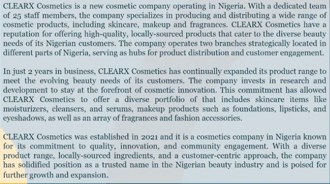
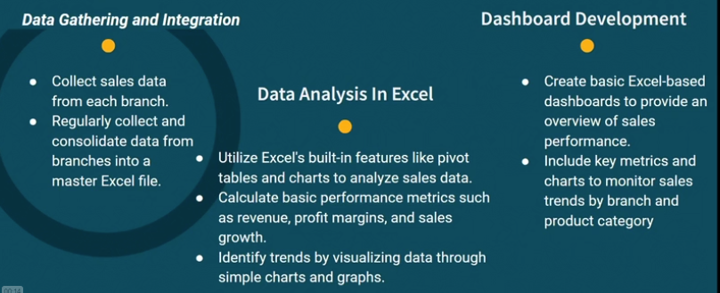
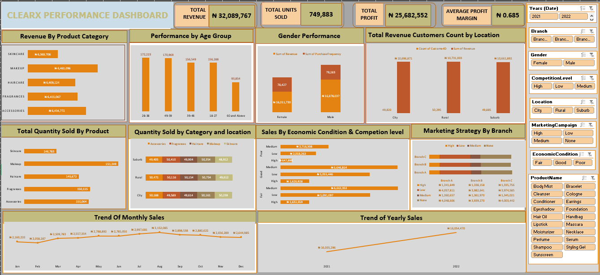

# Empowering-Decision-Makers-Innovative-Sales-Data-Visualization-through-Interactive-Dashboards

                      

This project provided a profound learning experience in data and sales analytics by utilizing real-world sales and customer data to assess performance and analyze customer behavior. Through Excel, I constructed a dynamic and interactive dashboard designed for sophisticated reporting. This task involved leveraging both intermediate and advanced Excel functions to interpret complex data sets effectively. The project enriched my analytical skills, enhancing my ability to navigate and make sense of intricate data landscapes.

## Learning points
-	Data Pre-processing 
-	Data Visualization 
-	Excel Functions and Formulas 
-	Dashboarding and Automation 
-	Sales Performance Assessment 
-	Customer Behavior Analysis 

## Project Overview 
-	Rationale for the Project 
-	Aim of the Project 
-	Data Description 
-	Tech Stack 
-	Project Scope
## Business Introduction:

## Business Overview/Problem 
CLEARX Cosmetics faces a significant business challenge in effectively monitoring and optimizing its sales performance across its branches. 
- The key obstacles the company encounters include: 
A. Data Fragmentation: Sales data is collected manually across the two branches, leading to fragmented, error-prone records. 
B. Limited Data Analysis: The lack of data analysis tools hinders the company's ability to gain insights into product performance, customer preferences, and regional trends. 
C. Resource Allocation: CLEARX Cosmetics struggles to allocate resources efficiently, leading to stockouts or overstock situations.

##  Rationale for the Project 
A. Data Centralization: Establish a centralized data repository for sales information from the two branches to eliminate fragmentation and enhance data consistency 
B. Basic Data Insights: Enable the company to obtain fundamental data insights, including sales trends, product performance, and customer preferences 
C. Cost-Efficiency: Provide a cost-efficient solution that aligns with the company's budget constraints while delivering essential data analysis capabilities. 
D. Streamlined Resource Allocation: Improve resource allocation by leveraging data-driven decisions to minimize stock outs and overstock situations. 

## Aim of the Project 
The project aims to achieve the following specific objectives: 
A. Develop a centralized data repository for sales data from all three branches, ensuring data consistency and accuracy. 
B. Implement basic data analysis techniques to gain insights into sales trends, product performance, and customer preferences. 
C. Create user-friendly dashboards for easy access to sales data and insights. 
D. Carry out basic data analysis, and dashboard utilization to enhance decision-making capabilities. 

## Data Description 
This dataset combines sales transaction data with customer information and provides insights into the company's sales performance, product categories, and customer demographics over the specified period. 
-	Date: The date of the sales transaction, ranging from January 1, 2021, to December 31, 2022. 
-	Product Category: The category of the product purchased, including "Skincare," "Makeup," or "Fragrances." 
-	Product Name: The specific product name purchased, such as "Body Wash," "Foundation," or "Body Mist." 
-	Unit Price: The price per unit of the product in Nigerian Naira (NGN). 
-	Quantity: The quantity of the product purchased in a single transaction. 
-	Revenue: The total revenue generated from the sales transaction in Nigerian Naira (NGN). 
-	CustomerID: The ID of the customer who made the purchase. 
-	Age: The age of the customer at the time of the sales transaction, ranging from 18 to 65 years. 
-	 Location: The location of the customer, representing various cities in Nigeria. 
-	Purchase History: A numerical value representing the customer's purchase history or frequency of making purchases. It ranges from 1 to 5, with higher values indicating more frequent purchases. 
-	Branch: The branch of the store where the transaction took place, with random distribution across three branches: 'Branch A,' 'Branch B,' and 'Branch C

## Tech Stack 
The analysis tool for this project is basic and focused on data analysis using Microsoft Excel. Utilize Excel's built-in features like pivot tables and charts to analyze sales data. 

## Data Analysis Project Scope:
-  Data Gathering and Integration 
A. Collect sales data from each branch. 
B. Regularly collect and consolidate data from branches into a master Excel file. 
-  Data Analysis In Excel 
A. Utilize Excel's built-in features like pivot tables and charts to analyze sales data. 
B. Calculate basic performance metrics such as revenue, profit margins, and sales growth. C. Identify trends by visualizing data through simple charts and graphs. 

## Dashboard Development: 
A. Create basic Excel-based dashboards to provide an overview of sales performance. 
B. Include key metrics and charts to monitor sales trends by branch and product category

## Link to Project

)

